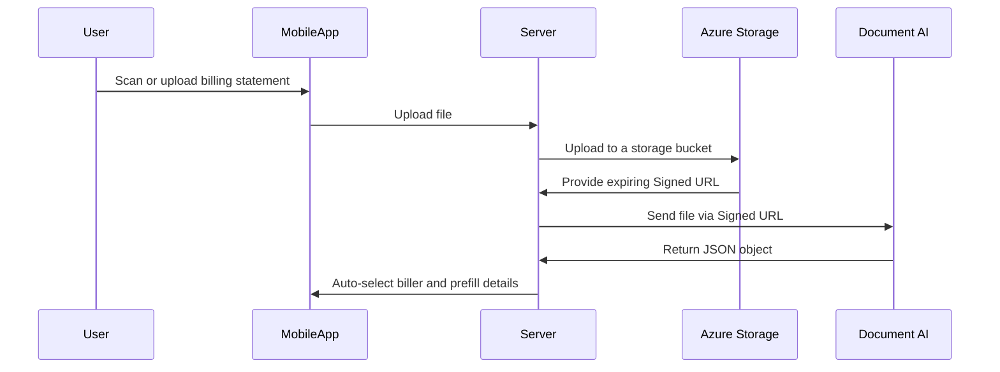

+++
author = "Daniel Cefram Ramirez"
tags = ["hackathon"]
date = 2024-12-11T20:29:28+08:00
title = "Microsoft Azure Open AI Hackathon 2024"
description = "We won first by not going the chatbot route"
slug = "microsoft-azure-open-ai-hackathon-2024"
type = "journal"
draft = true
toc = false
+++

I recently joined a workshop + hackathon event held in Microsoft's Philippines office, centered
around on using Azure's hosted Open AI GenAI capabilities. I know, it sounded like a mish-mash 
of words, but that's exactly how it was described XD.

Initially, I joined to set an example for the rest of the team to participate in the hackathon, but
unfortunately, it turned out to be just three out of the whole Digital Technology Division that joined
the hackathon, which represented less than 5% of the whole division >.<.

Hopefully, at the next hackathon—wherever it may be—many more engineers from our division will step up,
join the event, and showcase the bank's technical prowess! :P



The people that joined from the division I belonged were people who were also trying to set an example
for the rest of the team. They were my fellow Principal Engineer, Lem, and our QA Manager, Marky. We three
ended up being one team... In fact, we were the smallest team, with the average team size being 5 to 7 people.

The event went better than we expected, as we initially thought of going with the obvious route of creating
yet another chatbot, trying to squeeze an "AI Chatbot" into our existing application. Fortunately, Marky
floated another idea of using AI to parse the billing statements, and our app processing the data to auto
select and autofill all the billing details upon taking a photo of the bill.

The actual implementation was pretty simple:

We were able to get this all up and running in 3 hours time, with my laptop being the on-prem server for our
hackathon demo, while Lem did the implementation on our actual mobile app, connected to a lower test environment.

This idea was a good call, as the rest of the team presented chatbots upon chatbots, that by the time it was our
turn, everybody expected that we'd show a chatbot too... but low and behold, we presented them an actual running
mobile application, doing an actual product demo of the feature we just added. It felt like one of those sprint
demos that teams usually do after a sprint.

Thanks to the practicality of our idea—offering clear benefits to the end user—and the effective application of 
AI within our solution's context, we won first prize at the hackathon.



It was an awesome experience. The food was excellent, and since these products are typically quite pricey, having 
the opportunity to experiment with them without spending a penny was awesome... And obviously, bagging the first
place and getting a monetary price is always great XD.

As a product-oriented engineer, I’d love to see our idea eventually integrated into our official application. 
However, given the cost of these AI services, there’s still a long way to go in determining the idea’s commercial 
viability.
