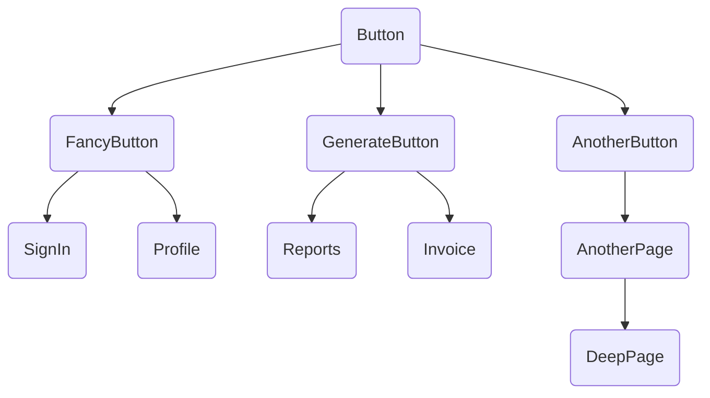

+++
author = "Daniel Cefram Ramirez"
tags = ["dev"]
date = 2023-11-04T10:37:19+08:00
title = "Making CI Pipelines Fast"
description = "We had pipelines that ran for almost an hour."
type = "post"
draft = false
+++

# Background

The project I am involved in at [Inspectorio](https://inspectorio.com) had a pretty standard process, where each merge request would run unit tests before we could merge it.


# The Problem

Our issue is that our pipelines take almost **an hour**, and the main culprit is our unit tests.

On the positive side, this meant that we do have a lot of unit tests which is directly related to the size of our project.

On the other hand, this would mean that the time our pipeline would run would increase as the codebase size increases.

What this meant is that for every change made in our feature branch, even if the change is minor (for example: syntax changes based on code review comments), we would need to wait for almost an hour before we can merge the changes.

This is painful as there were "old" flakey unit tests that for some reason, are hard to clean up. When those tests failed, it meant that we needed to retry the pipeline and wait for another hour before we could merge.

With that, we embarked on an effort to figure out how to speed up our pipelines without sacrificing the value we get from our unit tests.

# Making pipelines fast again

As we use Jest as our testing framework, we first did the obvious:

- Upgrade Jest to the latest version
- Evaluate alternatives like Vitest

The first one was pretty straightforward, as it was as simple as updating and version locking it to the latest available version. There were no breaking changes, or at least, we did not use any feature that was drastically modified.

However, our unit test steps still took almost an hour to finish. It's good we updated to the latest Jest, but it did not solve the problem we were trying to solve.

The second one, evaluating Vitest, was a little harder to do. Although doing simple benchmarks wasn't hard, it was migrating our 900+ test cases to use Vitest which was the main blocker. We couldn't simply change jest to vitest and call it a day, as we made heavy use of Jest's mocks. It was simply not economically viable to pursue Vitest.

Thankfully, Minh, one of my fellow developers, found two possible paths to optimize our pipelines:

- Jest's `--findRelatedTests`
- Caching the project's dependencies

Let's go over the two in more detail.

## Jest's --findRelatedTests

A little backstory. Our unit test steps used to use `--changedSince` flag, comparing the previous commit’s hash and supposedly running only those that changed. However, there were concerns that this approach was sufficient with the main concern being that it would only run the tests of the files that were modified. This meant that the tests of files that depended on the changed file would not run, which in theory is _just fine_ as we’re doing “unit” tests… but in practice, it does not give the confidence that we did sufficient tests.

Sure, we can just test the file that was modified, and just have enough test cases that would cover all potential usage of the function (or component). However, this won’t make us aware that a particular consumer of the function expects the function to behave in a certain way when consumed within the consumer’s context. It’s easy to modify the unit tests of the modified file according to the new “behavior” you are implementing, but being aware of how others use it is very important in a large application as we wouldn’t want to get regressions just because our change impacted a consumer where the end result isn’t as expected.

This is where `--findRelatedTests` comes came in handy. I won’t be going into details on how it behaves as there are these well-written references to refer to like this one: [Under the hood: how Jest find related tests works](https://thesametech.com/under-the-hood-jest-related-tests/). The gist of it, however, is that we would specify which source files to test, and jest would run the tests that would test the source files. This includes test files of all the other files that depend on the specified source file.

This means that if we modified the `Button` component, and we have 10 other files that consume the `Button` component and a further 5 components would depend on each of the 10 other files, and so on and so forth, `--findRelatedTests` would run the tests of all those consumers regardless of how deep it is in the dependency tree.



The diagram above is a naive visualization of what `--findRelatedTests` would _do_… which is, to find all files that depended on the target file (in this case, the Button), down to the very root of each branch, and run all of their tests.

This meant that we could have the confidence that we tested all possible files that are relevant to the changes of a particular commit, while only testing those that are absolutely necessary, and not running all of the tests in the project. The worst-case scenario would still be almost an hour if we modified a component that is used everywhere, but in most cases, we would only run a very small subset of the tests in the project as we don’t often modify base components.

## Cache project dependencies

We already use `npm ci` to install our dependencies, however, we found that for every unit test step we had in a single pipeline, we were installing the dependencies from scratch. We didn’t even use the `cache:` configuration in gitlab-ci.

The change was as simple as moving the installation of the dependencies to another pre-defined _stage_ called [.pre](https://docs.gitlab.com/ee/ci/yaml/#stage-pre).

```yaml
install:
  stage: .pre
  cache:
    - key:
        files:
          - package-lock.json
      paths:
        - node_modules/
      when: on_success
      policy: pull-push

    # store npm cache for all branches
    - key: $CI_JOB_NAME
      paths:
        - .npm/
      when: on_success
      policy: pull-push
  script:
    - npm ci --cache .npm --prefer-offline
```

We install the dependencies first before all other jobs, and the dependencies would be shared across all other jobs within the pipeline… as long as their package-lock.json file is the same (which is always the case).

If `npm ci` took 7 minutes to minutes, and we had 5 unit test jobs, we would end up having 35 extra minutes just for installing dependencies. With this change, we decreased the 35 minutes down to just 7 minutes as `npm ci` would only run exactly once in a pipeline.

# Conclusion

We have yet to see what the results are of the changes in how we run our unit tests. Rather than aiming for a high test coverage, we opted to only run directly relevant tests. One thing we consider though is running the full suite at a later stage instead (ex. after the changes are merged into the main branch).

But as far as test coverage is concerned, I think that running it locally and blocking the commit if it falls short should be sufficient. We don’t do that in this particular project “yet”, but another project that I do handle (albeit, it’s on Python) does this, using git hooks to run the unit tests and blocking the commit if it fails or if the coverage is below the threshold.

As for the cache, that’s pretty straightforward. No arguing here that separating the installation step from the rest of the pipeline is the right approach.
